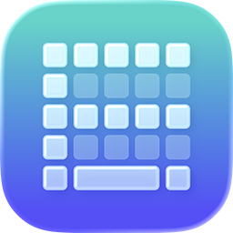

# Tadak



**타닥(Tadak)**은 macOS에서 작동하는 한글 입력기입니다.
김용묵 님이 개발하신 [날개셋 한글 입력기](http://moogi.new21.org/prg4.html)와의 호환을 목표로 하고 있습니다.

**참고** 타닥은 macOS 26 Tahoe 이상에서 동작하며, Intel Mac과 Apple Silicon Mac을 모두 지원합니다.


## 소개

널리 알려져 있는 두벌식과 세벌식 3-90, 세벌식 3-91 외에도 다양한 배열(신세벌식, 세모이, 로마자 등)을 사용하여 한글을 입력할 수 있습니다.

편집기(개발 중)를 사용하면 키보드 데이터를 마음대로 바꿀 수 있습니다.
더 빠르게 글을 입력할 수 있는 단축어를 추가하거나, 장시간 입력해도 손이 덜 피로하도록 낱자의 배열을 바꾸고, 다양한 보조 기능을 통해 자신만의 편의 기능을 추가할 수도 있습니다.


## 설치

1. [다운로드 페이지](https://github.com/KangWH/Tadak-public/releases/tag/0.1.2)에서 최신 버전의 설치 파일(`Tadak-macOS-0.1.2.pkg`)을 내려받은 다음 실행합니다.
1. 화면의 안내를 따라 설치를 완료합니다. 설치 위치는 변경하면 안 됩니다.
1. 설치가 완료되면 Mac을 재시동합니다.
1. ‘시스템 설정’ → ‘키보드’ → 입력 소스 오른쪽의 ‘편집...’을 클릭한 뒤 ‘타닥’을 추가합니다.
1. `control-space`를 눌러 현재 입력 소스를 타닥으로 전환합니다. 메뉴 막대에 ‘ㅌㄷ’ 아이콘과 함께 ‘두벌식’이라고 표시된 메뉴가 나타나면 정상적으로 전환된 것입니다.
1. ‘손쉬운 사용 권한’ 창이 표시되면 ‘시스템 설정 열기’를 클릭한 후, `Tadak-macOS`를 허용합니다.<br>
**참고** 대부분의 배열은 입력기를 재시작하지 않아도 문제 없이 사용할 수 있지만, 세모이 (모아치기)와 세모이 옛한글 (모아치기)을 사용하려면 입력기를 재시작해야 합니다. Mac을 재시동하거나 터미널에 다음 명령어를 입력하면 됩니다.
```bash
pkill -9 Tadak-macOS
```


## 키보드 선택하기

1. 메뉴 막대의 ‘두벌식’ 부분을 클릭한 뒤, 메뉴에서 ‘설정...’을 클릭합니다.
1. ‘키보드’ 탭에서 하단의 ‘추가...’ 버튼을 클릭합니다.
1. 원하는 배열을 선택한 뒤 ‘추가’ 버튼을 클릭하면 됩니다. 여러 배열을 추가한 경우, 배열 간 전환은 `option-shift-space`로 할 수 있습니다.
  - 배열 간 전환 단축키는 ‘단축키’ 탭에서 변경할 수 있습니다.

### 지원하는 배열

타닥은 현재 다음 배열을 지원합니다.

- **두벌식**
  - 두벌식 표준
  - 두벌식 옛한글
  - 두벌식 북한 표준
  - 두겹이 (0.1.2부터 지원)
  - 두줄이 (0.1.2부터 지원)
- **세벌식**
  - 세벌식 3-90
  - 세벌식 3-91 (최종)
  - 세벌식 순아래
  - 세벌식 3-93
  - 세벌식 3-2015 (0.1.2부터 지원)
  - 세벌식 3-2015 옛한글 (0.1.2부터 지원)
  - 신세벌식 1995
  - 신세벌식 2003
  - 신세벌식 P2
  - 신세벌식 P2 (기호 확장)
  - 신세벌식 P2 (옛한글)
  - 신세벌식 M
  - 신세벌식 M (제주어)
  - 세모이 (모아치기)
  - 세모이 (이어치기)
  - 세모이 옛한글 (모아치기)
  - 세모이 옛한글 (이어치기)
- **로마자-한글 입력**
  - 한컴 쿼티
  - 한컴 드보락
  - 한컴 콜맥
  - 공진청 쿼티
  - 공진청 드보락
  - 공진청 콜맥
- **라틴**
  - Qwerty
  - Dvorak
  - Colemak
  - Colemak-DH
  - Qwertz
  - Azerty

이외에도 [추가 키보드 데이터](./Keyboards/)를 불러와 사용할 수 있습니다.


## 추가 기능

### 한자 변환

한자 변환은 macOS 기본 한글 입력기와 동일하게 `option-return`으로 실행합니다.
- `↑`, `shift-space`: 이전 후보 선택
- `shift-↑`: 이전 페이지의 후보 선택
- `↓`, `space`: 다음 후보 선택
- `shift-↓`: 다음 페이지의 후보 선택
- `1`~`9`: 누른 번호에 해당하는 후보로 변환
- `return`: 선택된 후보로 변환
- `escape`: 변환 취소
- `←`, `→`: 변환 창 닫기 (`space`를 누르면 다시 표시됨)
- `tab`: 변환 창 확장·접기

세로쓰기 환경에서는 후보 창이 세로로 나타나며, 방향키도 그에 맞게 작동합니다.

**참고**
가능한 경우 단어 단위 변환을 우선 실행하며, Adobe 앱 등 주변 글자을 얻어올 수 없는 환경에서는 현재 조합 중인 글자의 변환을 실행합니다.

**참고**
설정에서 옵션을 켜는 경우, Windows 기본 한글 입력기와 동일하게 한글 자음자를 KS X 1001의 기호로 변환할 수 있습니다.

### 키보드 내장 데이터 변환

날개셋 한글 입력기의 ‘2단계 사용자 정의 후보’ 변환 기능을 제공합니다. 현재 세모이 키보드에서 해당 기능을 지원하며, 기본 단축키는 `option-shift-return`입니다. 변환 후보가 1개뿐인 경우 변환 창을 띄우지 않고 바로 변환되며, 2개 이상인 경우에는 한자 변환과 동일한 창이 표시됩니다.

### 화상 키보드

현재 사용 중인 배열을 화면에 표시해 줍니다. 갈마들이나 기호 확장 기능을 사용하는 배열의 경우 내부 오토마타의 현재 상태에 맞는 동작을 보여 줍니다.


## 삭제

1. 현재 활성 입력 소스를 타닥이 아닌 다른 입력기로 전환합니다.
1. 터미널을 연 뒤 다음 명령어를 입력합니다. 암호를 요구할 수 있습니다.
```bash
pkill -9 "Tadak-macOS"
sudo rm -rf "/Library/Input Methods/Tadak-macOS.app"
```
3. Mac을 재시동합니다.


## 알려진 문제

타닥은 현재 베타 버전입니다. 일부 정상적으로 작동하지 않는 부분이 있습니다.
- 다른 입력기에서 타닥으로 전환 시, `control-space` 등을 사용하면 다음 `space` 키 입력이 무시될 수 있습니다.
- 키를 떼는 이벤트가 정상적으로 인식되지 않을 수 있습니다. 일반적으로는 문제되지 않지만, 세모이 (모아치기) 배열을 사용하는 경우 모든 키를 떼어도 음절 조합이 종료되지 않을 수 있습니다. 이 경우 다른 배열이나 다른 입력기로 전환하면 정상적으로 사용할 수 있습니다.
- macOS 기본 터미널 앱에서 키를 떼는 이벤트가 정상적으로 작동하지 않습니다. iTerm2에서는 정상적으로 작동합니다.
- 날개셋 한글 입력기의 모든 동작이 동일하게 동작하지는 않습니다.

이외에도 알려지지 않은 호환성 문제가 있을 수 있습니다.


## 날개셋 한글 입력기와의 호환성

타탁 0.1.2의 내부 조합 엔진은 날개셋 한글 입력기 버전 10.85를 기준으로 개발되었습니다.
동작 호환성은 [별도의 표](NalgaesetCompatibility.md)를 통해 확인할 수 있습니다.


## 계획된 기능

현재 다음과 같은 기능이 계획되어 있습니다.

- **Tadak-macOS**
  - **날개셋 입력기와의 호환성 강화**
  - 더 많은 기본 키보드 추가
  - 화상 키보드 기능 (현재의 화상 키보드는 배열을 화면에 보여 주기만 하며, 클릭 등을 통해 문자 입력을 할 수는 없음)
  - 설정의 키보드 정보 화면에서 배열 미리보기
  - 날개셋 한글 입력기와 비슷한 방식의 키보드 전환 단축키 지정 UI
  - 키를 길게 눌렀을 때 팔레트 기능
  - 연속 변환 기능 (일본어·중국어 입력기나, 날개셋 한글 입력기의 ‘조합 안에 조합 생성’과 비슷한 기능)
- **Tadak-iOS**
  - 더 많은 기본 키보드 추가
  - 키 휙 넘기기 기능 구현 (iPad)
  - 스마트 구두점 기능 구현
  - 텍스트 대치 및 자동 완성 기능
  - 키를 길게 터치했을 때 팔레트 기능
- **Tadak-editor** (개발 중, 7월 중 베타 공개 예정)
  - 키보드 데이터 편집기


## 버그 제보

Tadak-macOS나 Tadak-iOS를 사용하다 버그가 발생한 경우, 페이지 상단의 ‘Issues’ 탭에 작성해 주시면 됩니다.
작성 시에는 아래의 양식을 참고해 주시기 바랍니다.

스크린샷 또는 화면 녹화본을 첨부해 주시면 원활한 오류 파악에 큰 도움이 됩니다.

### Tadak-macOS 버그 제보

- OS 버전 및 아키텍처(Intel 또는 Apple Silicon)
- 타닥 버전
- 버그가 발생하는 앱 (또는 앱에 무관하게 발생하는지)
- 동일한 조건에서 증상이 항상 발생하는지, 간헐적으로 발생하는지
- 카테고리
  - 입력기 자체의 결함 (크래시, 정상적으로 문자가 입력되지 않음, 키 입력이 인식되지 않음 등)
  - macOS 기본 입력기와의 동작 차이
  - 날개셋 한글 입력기와의 동작 차이

### Tadak-iOS 버그 제보

- OS 버전
- 타닥 버전
- 기기 종류 (iPhone, iPad (10.5인치 미만), iPad (10.5인치 이상), iPad (12.9인치 이상))
- 버그가 발생하는 앱 (또는 앱에 무관하게 발생하는지)
- 동일한 조건에서 증상이 항상 발생하는지, 간헐적으로 발생하는지
- 카테고리
  - 메인 앱의 버그 (설정, ‘써 보기’, 정보 화면 등)
  - 키보드 UI 버그 (입력에는 문제가 없으나 화면 표시가 정상적이지 않음)
  - 키보드 동작 버그 (입력이 정상적으로 실행되지 않음)
  - iOS/iPadOS 기본 키보드와의 동작 차이
  - 날개셋 한글 입력기와의 동작 차이

### 키보드 데이터 버그 제보

- 타닥 버전
- 데이터 버전
- 카테고리
  - 설명과 동작이 다름
  - 원본 데이터와 다르게 작동함
  - 문자를 정상적으로 입력할 수 없음 (낱자 조합, 음절 조합, 오토마타 규칙 등)
  - 정보(이름, 제작자, 홈페이지, 이메일, 설명, 라이선스 등)가 잘못됨


## 오픈소스 라이선스

이 앱은 [`libhangul`](https://github.com/libhangul/libhangul)의 한자 사전 데이터와 [Source Han Sans](https://github.com/adobe-fonts/source-han-sans) 서체를 사용합니다.
- [libhangul 한자 데이터](https://github.com/libhangul/libhangul/blob/a34aef73378c0992316861bbf13fc914ee7577d9/data/hanja/hanja.txt): BSD 3-Clause License
- [Source Han Sans 서체](https://github.com/adobe-fonts/source-han-sans/blob/0b993716f6910f0c8e00f957c767ab3cf5cb7602/LICENSE.txt): SIL Open Font License 1.1
